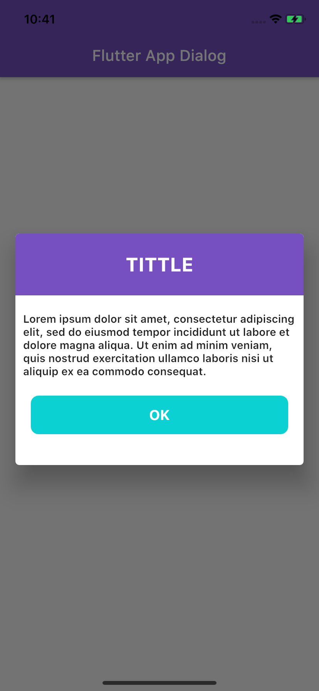
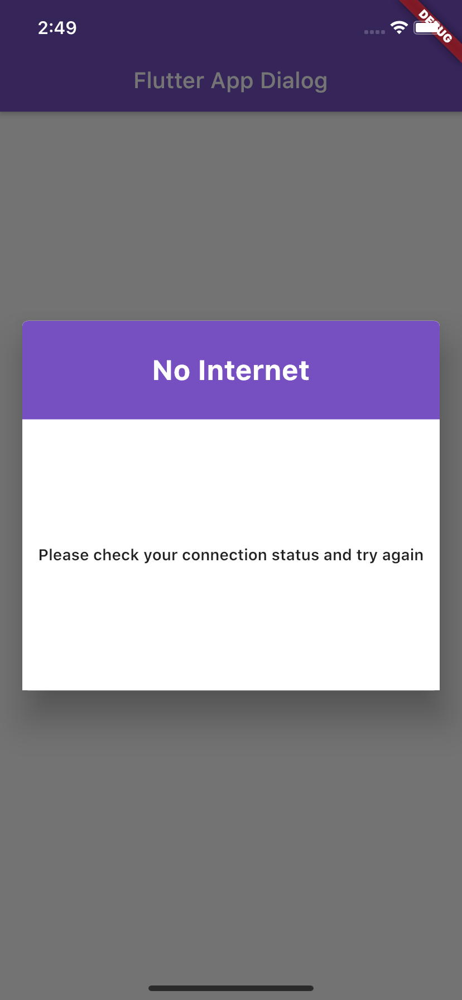

# flutter_app_dialog

flutter app dialog
A Flutter plugin for iOS and Android for simple and easy implement dialogs.

## Installation

Add `flutter_app_dialog` to your `pubspec.yaml` dependencies. 
## Example
### Info Dialog

```
showDialog(
              context: context,
              builder: (BuildContext context) {
                return BaseDialogWidget(
                  child: InfoDialog() ,
                );
              });
```
### No internet connection dialog

```
showDialog(
              context: context,
              builder: (BuildContext context) {
                return BaseDialogWidget(
                  child: NoInternetConnectionDialog() ,
                );
              });
```